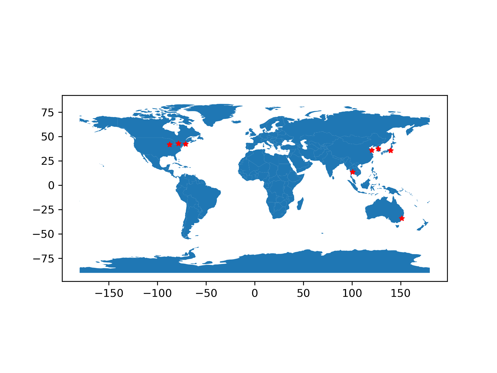

# **ip_plot**

[](https://travis-ci.org/suchak1/ip_plot)
[](https://shields.io/)
[](https://www.python.org/downloads/release/python-370/)
[](LICENSE.md)
[](https://github.com/suchak1/ip_plot/tags)

*ip_plot* is a project that simplifies plotting a list of ip addresses to a world map by mapping the addresses to latitude / longitude coordinates.

## Getting Started

### Prerequisites

Obtain a [free api key](https://ipstack.com/product) from [*ipstack*](https://ipstack.com). This will enable the mapping of an ip address to a geographic coordinate (latitude / longitude). Paste your api key in the `keys` dict in `creds.py`.

### Installation
**Linux**

To install the necessary packages, simply run:
```
./setup.sh
```
Note: This setup file installs miniconda, a minified version of the **Anaconda** distribution of *Python3*. Also, this setup has only been tested on Ubuntu 16.04.6 LTS (check the build status).

## Deployment

To produce a world map with locations of associated ip addresses marked, run:

```
python3 plot.py || python plot.py
```
Right now, ```plot.py``` uses random subsets of mock data from ```mock_data.txt``` and outputs ```map.png```.


## Result


## Files
```plot.py``` - main driver for *ip_plot*


```map.png``` - example map

```mock_data.txt``` - 1000 [random ip addresses](https://www.browserling.com/tools/random-ip)

```.travis.yml``` - build pipeline

```environment.yml``` - conda build environment

## License
This project is licensed under the MIT License - see the [LICENSE.md](LICENSE.md)
 file for details.

***

[](https://www.python.org/)

<!---
<<[](https://www.python.org/)>>
--->
